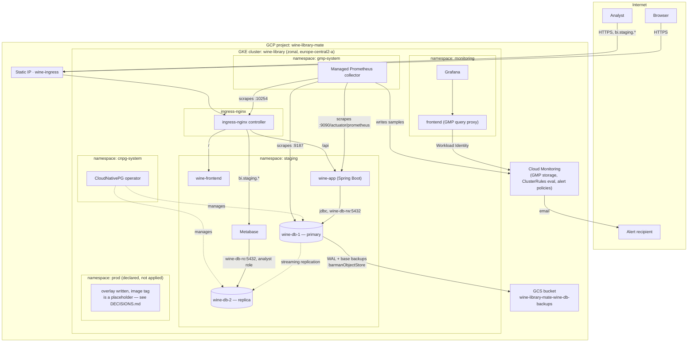

# Architecture

One page covering what's deployed, how traffic and data move, and why —
consolidated from `README.md`, `DECISIONS.md` and the `k8s/`/`terraform/`
READMEs rather than replacing them. Read those for the reasoning behind any
given choice; this page is the map.

## Overview

## Compute

**GKE cluster `wine-library`**, zonal (not regional, not Autopilot as of
2026-08-16 — see `DECISIONS.md`), `europe-central2-a`. One node pool,
`e2-standard-2`, autoscaling 2–3 nodes. Zonal rather than regional to keep the
region's `SSD_TOTAL_GB` quota usable — a regional pool spans three zones and
triples the boot-disk footprint for the same node count. The 2–3 ceiling
tracks the region's `IN_USE_ADDRESSES` quota of 4 (three nodes plus the
ingress static IP).

Everything runs as workloads inside this one cluster — no separate VMs.

## Networking

- **One static external IP** (`wine-ingress`, Terraform-managed) is the single
  entry point for every hostname. DNS (Cloudflare, `wine-library.xyz`) points
  every A record — `staging`, `bi.staging`, `grafana`, and eventually `@`/`www`
  for prod — at this one address.
- **One ingress-nginx controller** fronts all of it, rather than a
  `LoadBalancer` Service per app per environment — the difference between one
  cloud load balancer and several. It's also the portable choice: ingress-nginx
  runs unchanged on any Kubernetes cluster, unlike GKE's own Ingress.
- **Frontend and API share a hostname**, split by path
  (`staging.wine-library.xyz/` vs `.../api`) rather than a subdomain each —
  same-origin, so the browser sends no CORS preflight and the backend needs no
  CORS configuration. Metabase and Grafana get their own hostnames instead:
  they're operational tools, not part of the product surface.
- **TLS** via cert-manager + Let's Encrypt, HTTP-01 challenges (no DNS
  provider credentials need to live in the cluster). Two `ClusterIssuer`s exist
  — `letsencrypt-staging` for testing a new hostname's challenge without
  burning the production endpoint's tight per-hostname rate limit.

## Database

**PostgreSQL via the CloudNativePG operator**, in-cluster — not Cloud SQL.
Chosen for portability: the same manifests apply on any Kubernetes cluster,
where a managed database would need to be rebuilt on a provider switch.
Cluster provisioning and the backup endpoint are the only GCP-specific pieces
in the whole stack.

Each environment's `Cluster` is primary + one streaming replica (prod
currently patched to a single instance — see `overlays/prod/kustomization.yaml`
and the note in `DECISIONS.md` about dev never having carried a standby).
Three Services come from the operator:

| Service | Purpose | Used by |
| --- | --- | --- |
| `wine-db-rw` | primary, read-write | `wine-app` |
| `wine-db-ro` | replicas, read-only, load-balanced | Metabase, the `analyst` role |
| `wine-db-r` | any instance | unused |

The analyst connects through a read-only Postgres role, not a second
application-level datasource — Metabase is the only consumer of `wine-db-ro`.

## Backups

`barmanObjectStore`, continuous WAL archiving plus scheduled base backups, to
a GCS bucket via an S3-compatible HMAC key (`terraform/backup.tf`). Staging
and prod write to separate subfolders of the one bucket. 7-day retention,
enforced by barman itself; the bucket's own 30-day lifecycle rule is a longer
backstop, not the primary mechanism. Full recovery procedure, including the
point-in-time-recovery path for a bad migration, is in
[RECOVERY.md](RECOVERY.md) — marked as a draft until a restore has actually
been run once.

## Environments

| | staging | prod |
| --- | --- | --- |
| Status | live | overlay written, not applied |
| Purpose | integration target, QA, analytics | eventual production |
| Postgres | primary + replica | primary only (patched down) |
| Metabase | yes | not wired into the overlay yet |
| Image tag | moving `staging` tag | placeholder release tag |

`dev` existed and was removed on 2026-08-19 — Autopilot-era capacity couldn't
carry three environments, and once staging covered what dev did (backend and
frontend integration target), the third namespace was just idle Autopilot
request reservations. See `DECISIONS.md` for the full reasoning. Prod is
expected to replace staging outright at the end of the project rather than
run alongside it.

## CI/CD

Backend and frontend are separate repositories, each with its own
`build.yml`: lint/build, then push `ghcr.io/wine-library/{backend,frontend}`
tagged `:dev`/`:staging`/`:prod` by source branch, plus `:<sha>` always.

The infrastructure repo consumes the `:staging` tag two ways:

- **`deploy-staging.yml`** — triggers on push to `main` under `k8s/**`, applies
  `k8s/overlays/staging`. This is how a manifest change ships.
- **`image-sync` CronJob** — runs in-cluster (`k8s/components/image-sync`),
  every 2 minutes, comparing the digest behind the `:staging` tag in ghcr.io
  against what's actually running for `wine-app` and `wine-frontend`, and
  restarting whichever moved. This is how a new backend/frontend build ships
  without a manifest change. It used to be a GitHub Actions schedule
  (`sync-staging-image.yml`); measured over 62 hours that ran 97 of the 744
  ticks it asked for — GitHub schedules are best-effort and silently dropped,
  which is invisible until a deploy needs to happen quickly. The workflow now
  only exists as a `workflow_dispatch` button for forcing an immediate check.
  See `DECISIONS.md` for the measurement.

Both authenticate to GCP via **workload identity federation** — no static
service account key lives in either repo's secrets. The `github-deployer`
service account is scoped to `roles/container.clusterViewer` at the project
level (enough to fetch cluster credentials) plus a namespace-scoped
Kubernetes Role in `staging` only (`k8s/platform/deployer-rbac.yaml`) that
grants no `delete` and no secret access. A compromised runner can break a
deployment; it cannot drop the database or read its password.

Prod has no CI trigger yet — promoting an image to prod and applying the prod
overlay is still a manual step, to be wired up when prod actually goes live.

## Monitoring and alerting

**Google Managed Prometheus** stores metrics; Grafana in-cluster (stateless,
reads via a Workload-Identity-authenticated query proxy) draws them. Chosen
over a self-hosted kube-prometheus-stack because the latter's resource
footprint reliably forces a third node — see `DECISIONS.md` for the cost
comparison.

Scraped: `wine-app` (`/actuator/prometheus` on a management port separate
from application traffic — see `k8s/README.md` for why that separation is a
security boundary, not cosmetic), CloudNativePG (`:9187`), ingress-nginx
(`:10254`, the only signal actually measuring the product from outside).

`k8s/platform/monitoring/rules.yaml` (`ClusterRules`) defines five conditions
— app down, elevated 5xx rate, exhausted DB connection pool, replication lag,
node memory pressure — evaluated inside Managed Prometheus. Delivery to a
person is `terraform/monitoring_alerts.tf`: one Cloud Monitoring alert policy,
one email notification channel, grouped so each rule still surfaces as its
own incident.

## Security posture

- **No static credentials anywhere in either CI path** — workload identity
  federation for GitHub Actions, Workload Identity for Grafana's read access
  to Cloud Monitoring.
- **Deploy access is namespace-scoped and non-destructive** — see CI/CD above.
- **Certificates issue and renew themselves** via cert-manager, with a
  staging issuer to keep configuration mistakes off the production rate
  limit.
- **NetworkPolicy on Postgres** (`k8s/base/networkpolicy.yaml`) — only
  `wine-app`, Metabase, and the database's own pods (for replication) can
  reach port 5432. Everything else in the namespace is denied by default.
- **Seed data is gated by a Liquibase context** that no overlay passes any
  more, so the seed accounts (whose passwords are in a public repo) cannot
  land in staging or prod.
- **Audit logging** — see [SECURITY_AUDIT.md](SECURITY_AUDIT.md) for what's
  watched and the review cadence.

## What's out of scope on purpose

Demo/portfolio project, not a production system with an SLA: no
multi-region failover, no ArgoCD, no read replica for staging's replica, no
second datacenter. The line is drawn in `DECISIONS.md` per decision, not
here — this section just flags that the absence is deliberate, not an
oversight.
